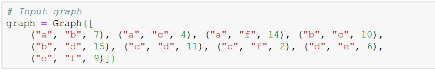
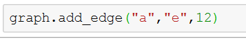
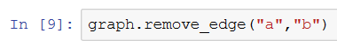

# Dijkstra's Algorithm Implementation in Python
### Objective
The goal is to build a quick graph implementation of the Dijkstra's algorithm, and write tests of their functionality 
Dijkstra's algorithm, conceived by Dutch computer scientist Edsger Dijkstra, is a graph search algorithm that solves the single-source shortest path problem for a graph with nonnegative edge path costs, producing a shortest path tree. This algorithm is often used in routing and as a subroutine in other graph algorithms.
### Deliverables
* A simple graph implementation with the public functionality mentioned above.
* An implementation of Dijkstra's algorithm.
* Unit tests for all public functions.
* README detailing your design decisions, resulting tradeoffs, and limitations of your implementations.
### Approach

### Rationale and Tradeoffs
#### Algorithm Performance:
* The complexity of the Dijkstra's algorithm is O(ElogV) where E is the number of edges and V is the number of vertices. I used the Data Structures that would not affect the time complexity of the algorithm.
#### Data Formats:
    * Used Named Tuple for storing edge data with a default value for the cost.
    * Path from one node to another is represented using the double-encoded queue [deque()] container.
    * deque containers are thread-safe and operations on them have a complexity of O(1)
### Implementation Details
#### Dijkstra's algorithm : 
Implementation is simple
* Mark all the nodes as unvisited
* set infinity as default distance between nodes
* Set unvisited node with smallest distance as current node
* Find unvisited neighbours for the current node and calculate their distances through the current node.
* Mark the current node as visited
* Stop once destination node has been visited
#### Additional Functionality
Methods have been implemented to 
* Add Edges/Nodes : add_edges(n1,n2,cost)
* Remove Edges : remove_edges(n1,n2)
* Get Neighboring Nodes : neighbours()
* Get shortest Path between two nodes : dijikstra(n1,n2)
#### Testing
* Using unittest test, a python’s xUnit style framework.
    Test cases for the implemented methods have been written in test.py
* Custom test cases
     Wrote custom test cases in tester.py
### Use
* All the implementation code can be found at dijkstra.py
* All the test cases can be found at test.py
* The Input graph is stored in graph.txt file. Each line in the file contains -> node1,node2,cost 
### Run
The graph has been hardcoded :
 
You can change the input graph in the graph.txt file.
dijkstra(n1,n2) 
 
add_edge(n1,n2,cost) 
 
remove_edge(n1,n2) 

### Limitations
* The implementation only supports undirected graph.
* The input and output is currently text based and does not provide a graphical UI.
* It is not the best solution for very large graphs as it uses the data storage is local.
### Future
* Develop an interactive web page using Python's flask framework for the implemented functionality
* Integrate a Graph Viz Library into the current application.
* Include a tracking system (logs) of nodes and edges that were added or removed.

