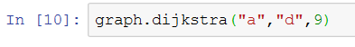
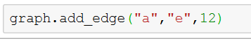
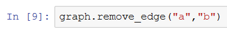

# Dijkstra's Algorithm Implementation in Python
### Objective
The goal is to build a quick graph implementation, implement Dijkstra's algorithm, and write tests of their functionality 
Dijkstra Algorithm 
### Deliverables
* A simple graph implementation with the public functionality mentioned above.
* An implementation of Dijkstra's algorithm.
* Unit tests for all public functions.
* README detailing your design decisions, resulting tradeoffs, and limitations of your implementations.
### Implementation Details
#### Dijkstra's algorithm : 
Implementation is simple
* Mark all the nodes as unvisited
* set infinity as default distance between nodes
* Set unvisited node with smallest distance as current node
* Find unvisited neighbours for the current node and calculate their distances through the current node.
* Mark the current node as visited
* Stop once destination node has been visited
#### Additional Functionality
Methods have been implemented to 
* Add Edges/Nodes : add_edges(n1,n2,cost)
* Remove Edges : remove_edges(n1,n2)
* Get Neighboring Nodes : neighbours()
* Get shortest Path between two nodes : dijikstra(n1,n2)
#### Testing
* Using unittest test, a python’s xUnit style framework.
    Test cases for the implemented methods have been written in test.py
* Writing custom test cases
     Wrote custom test cases in tester.py
### Use
* All the implementation code can be found at dijkstra.py
* All the test cases can be found at test.py
### Run
The graph has been hardcoded :

dijkstra(n1,n2)

add_edge(n1,n2,cost)

remove_edge(n1,n2)

### Future
* Develop an interactive web page using Python's flask framework for the implemented functionality
* Integrate a Graph Viz Library into the current application.

